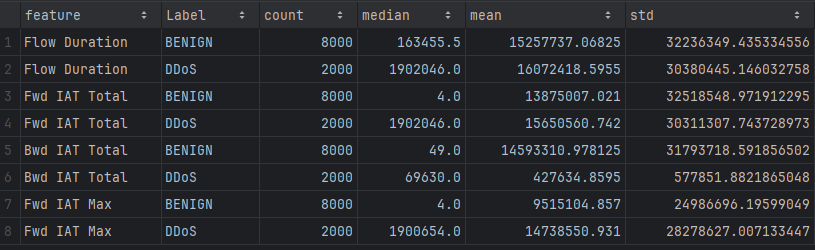

# MiniDDoS Detector

A lightweight pipeline for detecting Distributed Denial of Service (DDoS) attacks using dimensionality reduction
techniques. This project leverages the CICIDS2017 dataset to explore features and
visualize network flow patterns through Singular Value Decomposition (SVD).

## About the Dataset: CICIDS2017

The [CICIDS2017](https://www.unb.ca/cic/datasets/ids-2017.html) dataset was created to address the limitations of older
intrusion detection datasets. It includes both benign and attack traffic captured in realistic network conditions, with
labeled flows derived from PCAPs using CICFlowMeter. The dataset reflects modern attack types and user behavior across
protocols like HTTP, HTTPS, FTP, SSH, and email.

## Installation

```bash
git clone https://github.com/guilhermevazambuja/miniddos-detector.git
cd miniddos-detector
pip install -r requirements.txt
```

## Run

```bash
py main.py
```

## Data pipeline

The pipeline is designed to process and analyze network flow data to detect DDoS attacks. It performs the following
steps:

1. **Load and clean the dataset**
    - Handles missing values and outliers
    - Clips extreme values for stability

2. **Sample training and testing sets**
    - Creates balanced subsets with configurable ratios
    - Ensures diversity and separation between train/test

3. **Apply SVD (Singular Value Decomposition)**
    - Projects numeric features into 2D behavioral space
    - Extracts top components (SVD1 and SVD2)

4. **Project test data into the same SVD space**
    - Ensures consistent feature transformation

5. **Train and evaluate a Random Forest classifier**
    - Uses SVD1 and SVD2 as inputs
    - Reports accuracy, precision, recall, and F1-score

## Analysis Pipeline

The Analysis pipeline provides visual and statistical insights into the CICIDS2017 dataset and the behavior of DDoS vs
BENIGN flows. It complements the main detection pipeline by helping understand which features are most influential and
how they differ across classes. It performs the following steps:

1. **Label Distribution Visualization**
    - Generates a pie chart showing the proportion of BENIGN and DDoS samples in the dataset.

2. **SVD Projection Plot**
    - Visualizes the 2D projection of flows using SVD1 and SVD2 components.
    - Highlights behavioral clustering between BENIGN and DDoS traffic.

3. **Feature Importance Extraction**
    - Identifies the top 4 features contributing most to SVD1 and SVD2.
    - Saves component weights and feature rankings.

4. **Feature Statistics and Distributions**
    - Computes summary statistics (count, mean, median, std) for each top feature by label.
    - Calculates percentiles, skewness, and zero counts to assess distribution shape.
    - Saves results as CSV tables for inspection.

5. **Box and Violin Plots**
    - Generates side-by-side boxplots and violin plots for each top feature.
    - Helps visualize how feature distributions differ between BENIGN and DDoS flows.

All visual outputs and tables are saved in the `reports/` folder.

## Feature Guide

Inside the `docs/` folder, the `feature_guide.csv` file offers a detailed reference for all CICIDS2017 features,
including their original names, short summaries, and full descriptions. It's a helpful resource for interpreting results
and understanding each feature's role in network flow analysis.

## Interactive Notebook

This project includes a Jupyter notebook located in the `notebooks/` folder. The notebook walks through the entire
pipeline step by step, allowing you to explore the dataset, visualize distributions, apply SVD, and train a classifier
interactively.

- Load and clean the CICIDS2017 dataset
- Visualize label distribution and feature behavior
- Sample training and testing sets
- Apply SVD and inspect components
- Train and evaluate a Random Forest model
- Experiment with plots and metrics in real time

## Relevant links

[A Detailed Analysis of the CICIDS2017 Data Set](https://link.springer.com/chapter/10.1007/978-3-030-25109-3_9)

[Enhancing Generalizability in DDoS Attack Detection Systems through Transfer Learning and Ensemble Learning Approaches](https://www.youtube.com/watch?v=zaRsIJy21xM)

[SVD Visualized, Singular Value Decomposition explained](https://www.youtube.com/watch?v=vSczTbgc8Rc)

## Images

<div style="display: flex; flex-direction: column; gap: 20px; align-items: center;">

  
  
  
  
  

</div>